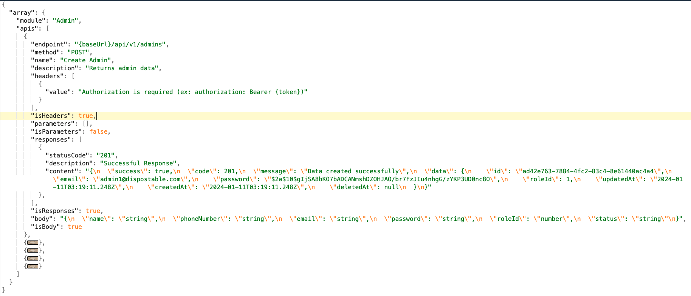
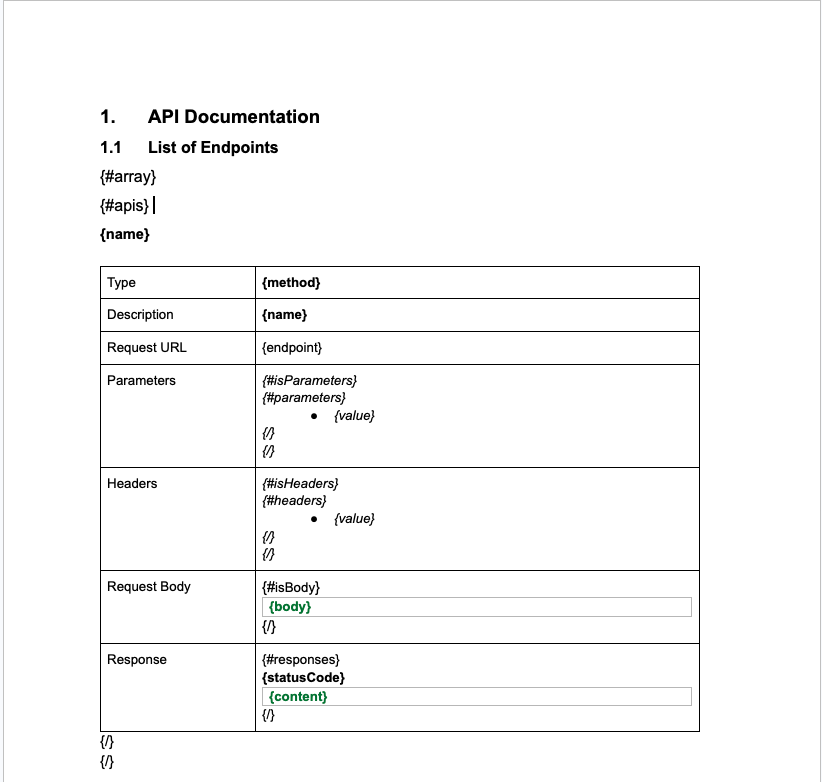
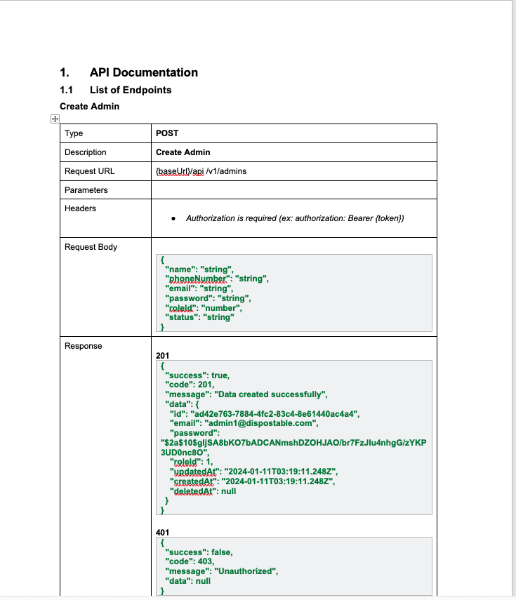

# Json2Doc

> Seamless API documentation generator from JSON specs. Transform Swagger or Postman collections into professional DOCX files in seconds.

[](https://www.npmjs.com/package/@dctrl/crudify)
[](LICENSE)

---

## 📦 Installation

```bash
npm install -g @dctrl/crudify
```

> Or use it locally in your project:

```bash
npm install --save-dev @dctrl/crudify
```

---

## 🛠️ Usage

```bash
json2doc convert sample.json --platform=swagger
```

### Options

| Option|Description|
|-|-|
| `--platform=<platform>`| Input type: swagger, postman|
| `--output <filename>`| Output file path|
| `--template <file>`| Path to custom DOCX template|

### Example

Convert with file swagger.json to DOC:

```bash
json2doc convert sample.json --platform=swagger
```

Convert with file postman.json to DOC:

```bash
json2doc convert sample.json --platform=postman
```

Convert with custom output filename:

```bash
json2doc convert sample.json --platform=swagger --output=custome-api.docx
```

Convert with custom template:

```bash
json2doc convert sample.json --platform=swagger --template=custome-template.docx
```
Note: If you use the --template option, make sure your template file matches the format expected by json2doc.

For example, you can provide a template as shown below:



---

## 📄 Output File



---

## 📄 License

This project is licensed under the MIT License – see the [LICENSE](LICENSE) file for details.

---